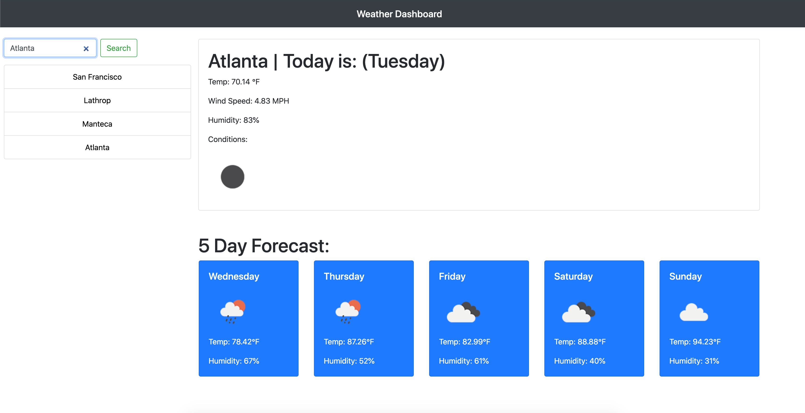

# Weather-dashboard
A simple dashboard. So, they said. This assignment uses a variety of technologies to generate one sole goal. Display the weather. As a developer, that information is absent in the creation of a website, so we must (as developers) look towards places that do have that information stored inside a server. These are called server-side APIs. They contain vast amounts of information that one can manipulate and push that information onto a page. The tools necessary are found within a few technologies recently presented to us, Jquery and Ajax. Using the OpenWeather API we are presented a plethora of information that we must use and manipulate to create a functional weather application in its diverse form. 

## Site picture 

* Here is the front page of this website that uses bootstrap (A CSS Framework) to create an elegant and organized look to the page.

## Installing 
Jquery, bootsrap, and Ajax are a series of third-party libraries that requires the proper CDN links to be able to use the full functionality of these libraries. A code snippet below shows the script tags located at the bottom of the HTML Doc. 

### Code Snippet

```
 <script src="https://code.jquery.com/jquery-3.5.1.slim.min.js" integrity="sha384-DfXdz2htPH0lsSSs5nCTpuj/zy4C+OGpamoFVy38MVBnE+IbbVYUew+OrCXaRkfj" crossorigin="anonymous"></script>
    <script src="https://cdn.jsdelivr.net/npm/popper.js@1.16.0/dist/umd/popper.min.js" integrity="sha384-Q6E9RHvbIyZFJoft+2mJbHaEWldlvI9IOYy5n3zV9zzTtmI3UksdQRVvoxMfooAo" crossorigin="anonymous"></script>
    <script src="https://stackpath.bootstrapcdn.com/bootstrap/4.5.0/js/bootstrap.min.js" integrity="sha384-OgVRvuATP1z7JjHLkuOU7Xw704+h835Lr+6QL9UvYjZE3Ipu6Tp75j7Bh/kR0JKI" crossorigin="anonymous"></script>
    <script src="script.js"></script>
    <script src="https://cdnjs.cloudflare.com/ajax/libs/jquery/3.2.1/jquery.min.js"></script>
```
* These links are vital to the functionality in the use of these libraries. It's a simple link, but when missing attributes, can destroy the functionality of the page all together. 

## Deployed links
[Link to Repository](https://github.com/Kionling/Weather-dashboard)
[Link to Deployed Site](https://kionling.github.io/Weather-dashboard/)

## Author 
* **Daniel Jauregui**
[Twitter](https://twitter.com/Kionling1)
[Instagram](https://www.instagram.com/kionling1/)
[LinkedIn](https://www.linkedin.com/in/daniel-jauregui-velazquez-b64a80172/)

## Acknowledgements
- Dad. Always pushing me to strive for better. 
- Bootstrap Documentation